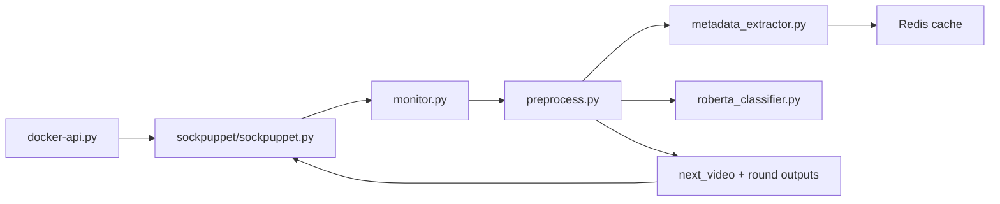

# YouTube Intervention

A runtime pipeline for YouTube sock-puppet experiments with automated intervention, metadata retrieval, and RoBERTa-based content classification.

> Model checkpoints are hosted on Hugging Face and are not bundled in this repository.

The system is designed to:

- create and train automated YouTube accounts on curated watch histories,
- collect homepage or up-next recommendations over repeated rounds,
- classify recommended videos with binary and multiclass RoBERTa models,
- apply intervention strategies such as `downrank`, `replace`, or `none`,
- save round-by-round experiment outputs for downstream analysis.

## At a Glance

| Component | Purpose |
|---|---|
| `docker-api.py` | Launches and orchestrates sock-puppet runs |
| `sockpuppet/sockpuppet.py` | Drives YouTube viewing behavior and recommendation collection |
| `monitor.py` | Coordinates round-level preprocessing |
| `preprocess.py` | Scores recommendations and applies interventions |
| `metadata_extractor.py` | Fetches and caches metadata in Redis |
| `roberta_classifier.py` | Serves binary and multiclass harmful-content models |

## Workflow



## What This Repository Does

At a high level, the repository implements an end-to-end experimental loop:

1. `docker-api.py` generates experiment configurations and launches sock-puppet runs.
2. `sockpuppet/sockpuppet.py` drives YouTube viewing behavior and collects recommendations.
3. `monitor.py` coordinates round-level preprocessing.
4. `preprocess.py` fetches metadata, scores recommendations, applies the selected intervention, and chooses the next video.
5. `metadata_extractor.py` caches YouTube metadata in Redis.
6. `roberta_classifier.py` serves the binary and multiclass RoBERTa classifiers.

The repository currently focuses on the runtime pipeline. Local exploratory scripts and archival analysis code have been intentionally excluded from this version.

## Repository Structure

```text
.
├── data/
│   └── training/
│       ├── harmful.csv
│       └── non_harmful.csv
├── infra/
│   └── control-plane.Dockerfile
├── sockpuppet/
│   ├── Dockerfile
│   ├── requirements.txt
│   └── sockpuppet.py
├── docker-api.py
├── docker-compose.yml
├── metadata_extractor.py
├── monitor.py
├── preprocess.py
├── redis_inspector.py
├── requirements.txt
├── roberta_classifier.py
└── README.md
```

## Requirements

### System

- Python 3.10+
- Docker
- Google Chrome support for the sock-puppet container
- Redis

### Python Dependencies

Install the control-plane dependencies from the repository root:

```bash
pip install -r requirements.txt
```

The sock-puppet container uses its own dependency file:

```bash
pip install -r sockpuppet/requirements.txt
```

## Models

This repository does not include the RoBERTa checkpoints.

The released model weights are hosted on Hugging Face:

- Binary classifier: [xiaoman77/yt-intervention-binary](https://huggingface.co/xiaoman77/yt-intervention-binary)
- Multiclass classifier: [xiaoman77/yt-intervention-multiclass](https://huggingface.co/xiaoman77/yt-intervention-multiclass)

To run the classifier service locally, download the model files and place them under:

- `models/binary`
- `models/multiclass`

Example:

```bash
huggingface-cli download xiaoman77/yt-intervention-binary --local-dir models/binary
huggingface-cli download xiaoman77/yt-intervention-multiclass --local-dir models/multiclass
```

The code expects these directories locally at runtime, so the Hugging Face checkpoints should be downloaded into the paths above before starting the classifier service.

## Configuration

### YouTube API Keys

`metadata_extractor.py` expects YouTube API keys through an environment variable:

```bash
export YOUTUBE_API_KEYS="key1,key2,key3"
```

### Runtime Defaults

The current code assumes the following default local endpoints:

- Redis: `redis://localhost:6379/0`
- Metadata service: `http://localhost:6000`
- Classifier service: `http://localhost:9000`
- Monitor service: `http://localhost:5000`

Within the sock-puppet container, the monitor is reached through:

- `http://host.docker.internal:5000`

## How To Use The Code

There are two supported ways to run the system:

- manual startup, where each service is launched separately,
- optional Docker Compose startup for the control-plane services.

### Option A: Manual Startup

1. Export YouTube API keys:

```bash
export YOUTUBE_API_KEYS="key1,key2,key3"
```

2. Start Redis:

```bash
redis-server
```

3. Start the metadata service:

```bash
python metadata_extractor.py
```

4. Start the classifier service:

```bash
python roberta_classifier.py
```

5. Start the monitor service:

```bash
python monitor.py
```

6. Build the sock-puppet image:

```bash
python docker-api.py --build
```

7. Launch experiments:

```bash
python docker-api.py --run --steps combined
```

### Option B: Docker Compose For The Control Plane

The repository also includes an optional Compose setup for Redis, metadata extraction, classification, and monitoring.

Start the control plane:

```bash
docker compose up --build
```

Then launch experiments in a separate terminal:

```bash
python docker-api.py --build
python docker-api.py --run --steps combined
```

This Compose setup is optional and does not replace the manual workflow.

### Minimal Manual Order

If you only need the shortest startup order, the runtime sequence is:

1. Start Redis
2. Start `metadata_extractor.py`
3. Start `roberta_classifier.py`
4. Start `monitor.py`
5. Run `docker-api.py`

## Workflow

The runtime workflow is:

1. `docker-api.py` samples training videos from `data/training/`.
2. It launches sock-puppet containers with the desired focus and intervention type.
3. `sockpuppet/sockpuppet.py` trains the puppet and collects recommendations each round.
4. Recommendations are written to `shared/<puppet_id>/recommendations_<round>.txt`.
5. `monitor.py` receives a request to preprocess the round.
6. `preprocess.py`:
   - loads the round recommendations,
   - fetches metadata through `metadata_extractor.py`,
   - scores videos through `roberta_classifier.py`,
   - applies `downrank`, `replace`, or `none`,
   - writes the selected next video for the following round.
7. The puppet watches the selected next video and continues to the next round.
8. Outputs are saved for later inspection.

## Key Runtime Files

- `docker-api.py`: experiment launcher and Docker orchestration
- `sockpuppet/sockpuppet.py`: YouTube automation and round execution
- `monitor.py`: round coordination service
- `preprocess.py`: intervention logic and next-video selection
- `metadata_extractor.py`: metadata retrieval and Redis-backed caching
- `roberta_classifier.py`: binary and multiclass classification service

## Outputs

During a run, the pipeline creates local runtime directories such as:

- `output/`
- `logs/`
- `shared/`
- `experiment_data/`
- `local_logs/`

These are intentionally ignored by Git.

## Intervention Modes

The current runtime supports:

- `none`: preserve the original ranked recommendations
- `downrank`: move higher-harm items lower in the ranking
- `replace`: replace harmful items with items from a harmless pool

## Reproducibility Notes

- The training pools are currently read from `data/training/harmful.csv` and `data/training/non_harmful.csv`.
- Model checkpoints must be supplied separately.
- Service endpoints are currently configured in code and should be kept consistent across the local environment.

## Current Scope

This repository is intended to provide the runtime pipeline for the experiment rather than the full paper artifact package.

It currently includes:

- the sock-puppet runtime,
- intervention and preprocessing services,
- metadata and classifier services,
- training video pools,
- optional local orchestration with Docker Compose.

## Notes For Public Release

This repository is intended to contain the runtime code only.

It does not bundle:

- private API keys,
- large model checkpoints,
- local logs or outputs,
- exploratory preprocessing notebooks or archival analysis scripts.

## Citation
